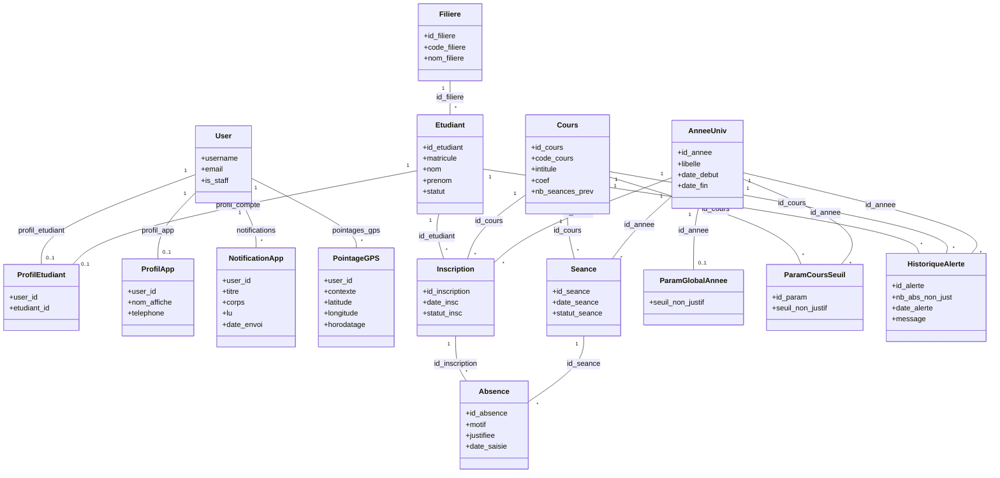
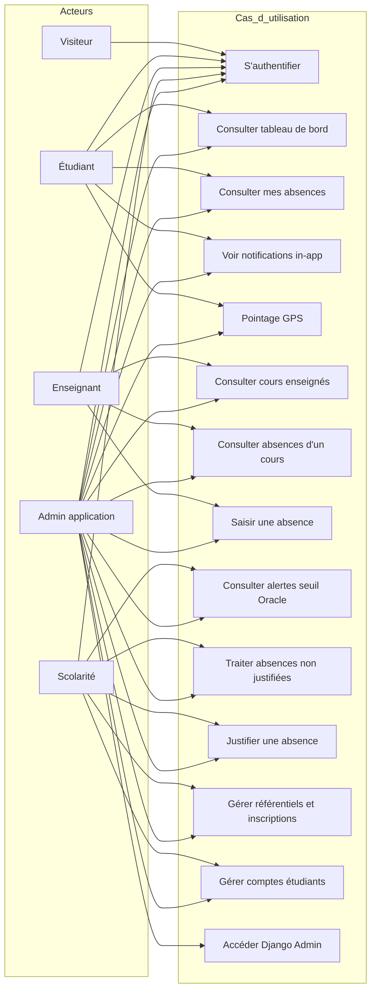

# Projet Django & Oracle — Alignement avec la grille d’évaluation ISCAE (MQI)

Ce document relie **votre implémentation réelle** (dépôt `projet_oracle`) aux **questions type** de la fiche d’évaluation de compréhension. Il sert de support oral ou écrit pour l’entretien avec votre professeur.

**Références utiles dans le code :**

- Schéma Oracle : `oracle/01_tables_sequences.sql`, `oracle/02_package_and_triggers.sql`
- Sécurité Oracle (rôle / privilèges) : `oracle/04_privileges_role.sql`
- Modèles Django ↔ tables : `absence/models.py` (`managed = False` pour le métier Oracle)
- Appels PL/SQL : `absence/services/oracle_absences.py`
- Rôles applicatifs : `absence/roles.py`, décorateur `@role_required` dans `absence/views.py`
- Paramètres connexion : `projet_oracle/settings.py`, variables `.env` (`ORACLE_*`)
- Cadrage projet : `CADRAGE_TECHNIQUE.txt`

---

## Point sur l’alerte « seuil » vs « Notifications »

- **Page absences / tableau de bord** : l’étudiant voit les alertes issues de **`HISTORIQUE_ALERTE`** (Oracle), calculées par le trigger **`TRG_ABSENCE_AIUD_QUOTA`** après insert/mise à jour d’une absence non justifiée.
- **Notifications (table Django `NotificationApp`)** : messages in-app (ex. scolarité informée, **et** synchronisation des alertes seuil via `absence/services/seuil_notifications.py` lors de l’ouverture du tableau de bord ou de « Mes absences », pour que le même événement apparaisse aussi dans l’écran Notifications).
- Le texte Oracle du message peut afficher **code cours / libellé année** une fois le trigger à jour dans `oracle/02_package_and_triggers.sql` ; les lignes déjà enregistrées dans `HISTORIQUE_ALERTE` conservent l’ancien libellé tant qu’on ne les régénère pas.

---

## Synthèse par thèmes (réponses aux questions Q1–Q56)

### Objectif, acteurs, fonctionnalités (Q1–Q3)

| Question | Ce que couvre le projet |
|----------|-------------------------|
| **Q1 Objectif / problème réel** | Gestion des **absences** en contexte universitaire : saisie par l’enseignant, consultation par l’étudiant, **seuils d’absences non justifiées** avec **historique d’alerte** et information de la scolarité, **justification** par la scolarité. |
| **Q2 Fonctionnalités principales** | Connexion Django ; **étudiant** : tableau de bord, mes absences, notifications, pointage GPS optionnel ; **enseignant** : cours, liste des absences, saisie d’absence (Oracle : package) ; **scolarité** : alertes Oracle, absences à traiter, justification, synthèse, **gestion** (étudiants, cours, inscriptions, séances, comptes) ; **admin** : Django admin + groupe `Admin_application`. |
| **Q3 Acteurs** | **Étudiant**, **Enseignant**, **Scolarité**, **Admin application** (groupes Django). Les identités métier Oracle ne sont pas des « utilisateurs Oracle » : elles sont des **données** (table `ETUDIANT`, etc.). |

### Choix techniques Django + Oracle (Q4–Q7)

| Question | Réponse alignée projet |
|----------|-------------------------|
| **Q4 Pourquoi Django + Oracle** | Django pour l’**interface web**, l’**authentification**, les **rôles** et les tables **applicatives** (notifications, profils). Oracle pour la **persistance métier** structurée, **intégrité forte**, **PL/SQL** (package, triggers) proche des données. |
| **Q5 Connexion Django ↔ Oracle** | Backend `django.db.backends.oracle` dans `settings.py` ; driver **oracledb** (mode thick / Instant Client pour Oracle 10g, voir commentaires dans `settings.py`). L’ORM lit les tables **`managed = False`**. Les écritures sensibles passent par **`cursor.callproc`** vers `PKG_GESTION_ABSENCES` (`oracle_absences.py`). |
| **Q6 Création BDD Oracle / CDB** | Scripts SQL versionnés (`oracle/01…`, `02…`). Le dépôt **ne impose pas** CDB/PDB : c’est en pratique une **base ou schéma classique** (ex. XE 10g ou instance distante), selon votre environnement. |
| **Q7 Locale / distante / conteneurisée** | **Configurable** via `.env` : `ORACLE_HOST`, `ORACLE_PORT`, `ORACLE_NAME` (SID ou service). Souvent **locale** en TP ; **distante** possible. **Pas de Docker imposé** par le projet dans les fichiers fournis. |

### Sécurité Oracle : utilisateur technique, privilèges, rôles (Q8–Q10)

| Question | Réponse alignée projet |
|----------|-------------------------|
| **Q8 Utilisateur technique** | Un compte Oracle sert de **connexion applicative** (ex. `ABS_APP` ou utilisateur dédié `DJANGO_ORA_TECH` dans la variante `04_privileges_role.sql`). On n’utilise **pas** les utilisateurs finaux comme comptes Oracle : les personnes se connectent à **Django** ; Oracle ne gère pas leurs mots de passe métier. |
| **Q9 Privilèges** | Fichier `oracle/04_privileges_role.sql` : rôle **`R_APP_ABSENCES`** avec **SELECT/INSERT/UPDATE/DELETE** sur les tables métier nécessaires, **EXECUTE** sur **`PKG_GESTION_ABSENCES`**, **SELECT** sur les **séquences**. Principe du **moindre privilège**. |
| **Q10 Mesures de sécurité** | **Rôle Oracle** agrégé ; pas de `GRANT` large type `DBA` pour l’app ; **séparation** schéma propriétaire / utilisateur technique possible ; côté Django : **CSRF**, **sessions**, **mots de passe** hors code (`.env`). |

### Conception données (Q11–Q20)

| Question | Réponse alignée projet |
|----------|-------------------------|
| **Q11 MCD / classes / MLD** | Conception **préalable** reflétée par les scripts Oracle + modèles Django en miroir. Document interne `CADRAGE_TECHNIQUE.txt`. Les diagrammes **ci-dessous** complètent la trace écrite. |
| **Q12 Tables principales** | **FILIERE**, **ANNEE_UNIV**, **COURS**, **ETUDIANT**, **INSCRIPTION** (étudiant–cours–année), **SEANCE**, **ABSENCE** (liée inscription + séance), **PARAM_GLOBAL_ANNEE** / **PARAM_COURS_SEUIL** (seuils), **HISTORIQUE_ALERTE** (alertes quota). Côté Django : **LIEN_COMPTE_ETUDIANT**, **ABSENCE_PROFIL_APP**, **NotificationApp**, **PointageGPS**. |
| **Q13 Clés primaires** | Identifiants **NUMBER** + séquences Oracle (triggers `BEFORE INSERT`), mappés en `AutoField` / `OneToOneField` côté Django. Cohérent pour un modèle relationnel avec surrogate keys. |
| **Q14 Clés étrangères** | Ex. **ETUDIANT.ID_FILIERE** → **FILIERE** ; **INSCRIPTION** → **ETUDIANT**, **COURS**, **ANNEE_UNIV** ; **ABSENCE** → **INSCRIPTION**, **SEANCE**. |
| **Q15 Formes normales** | Modèle **décomposé** (pas de répétition de l’étudiant dans chaque absence : passage par **INSCRIPTION**). Attributs dépendants de la clé ; pas de groupe répétitif dans une même ligne → visée **1NF–3NF** pour le cœur métier. |
| **Q16–Q17 Contraintes** | **NOT NULL**, **UNIQUE** (codes, matricule, triple inscription), **CHECK** (statuts, dates, coef), **FOREIGN KEY** — voir `01_tables_sequences.sql`. |
| **Q18 Cohérence** | **Contraintes** + **triggers** (ex. cohérence séance/inscription, étudiant actif) + **package** qui centralise règles à l’insertion. |
| **Q19 Vues / vues matérialisées** | **Non** présentes dans les scripts livrés ; possibilité d’évolution (ex. vue pour reporting scolarité). |
| **Q20 Importance de la conception** | Moins de bugs, **intégrité** au plus près du SGBD, **évolutivité** (seuils paramétrables par cours/année). |

### PL/SQL : package, fonctions, procédures, triggers (Q21–Q29)

| Question | Réponse alignée projet |
|----------|-------------------------|
| **Q21 Logique en base** | **Oui** : enregistrement structuré d’absence, calcul de seuil, **alertes automatiques**, protection des séances modifiées après absences. Intérêt : **une seule source de vérité** même si plusieurs clients accèdent à Oracle. |
| **Q22 Bloc PL/SQL** | Corps du **package**, **triggers** `BEFORE` / `AFTER`. |
| **Q23 Fonctions** | Ex. **`F_NB_ABSENCES_NON_JUST`** (avec transaction autonome pour éviter ORA-04091 depuis le trigger), **`F_SEUIL_NON_JUSTIF`**. |
| **Q24 Procédures vs fonctions** | **`P_ENREGISTRER_ABSENCE`** (OUT `p_id_absence`), **`P_MAJ_ABSENCE_JUSTIF`** : procédures pour effets de bord transactionnels ; fonctions pour **valeurs calculées**. |
| **Q25 Packages** | **`PKG_GESTION_ABSENCES`** : spec + body — regroupe fonctions/procédures liées aux absences. |
| **Q26 Appel depuis Django** | `connection.cursor().callproc('PKG_GESTION_ABSENCES.P_ENREGISTRER_ABSENCE', [...])` avec variable de sortie pour l’ID (`oracle_absences.py`). |
| **Q27–Q28 Exemple trigger** | **`TRG_ABSENCE_AIUD_QUOTA`** : après insert/update de **JUSTIFIEE**, calcule si le **seuil** est franchi et insère dans **HISTORIQUE_ALERTE**. **`TRG_ABSENCE_BI_VALID`** : avant insert absence, vérifie cohérence inscription/séance. **`TRG_SEANCE_BU`** : empêche modification structurante d’une séance ayant déjà des absences. |
| **Q29 BEFORE vs AFTER** | **BEFORE** : valider / bloquer avant écriture (**`TRG_ABSENCE_BI_VALID`**). **AFTER** : réactions une fois la ligne posée (**quota** → **`HISTORIQUE_ALERTE`**). |

### Transactions, performance, concurrence (Q30–Q36)

| Question | Réponse alignée projet |
|----------|-------------------------|
| **Q30 Transactions** | Django : **`transaction.atomic()`** autour des appels Oracle. Oracle : **COMMIT/ROLLBACK** implicites par transaction ; en cas d’erreur dans le package, **rollback** de la transaction Django. |
| **Q31 Table volumineuse** | **ABSENCE** (croît avec chaque séance × étudiants) ; **HISTORIQUE_ALERTE** si beaucoup de franchissements de seuil. |
| **Q32 Index** | **Clés primaires / uniques** créent des index Oracle. Pas d’index secondaires explicites dans `01_tables_sequences.sql` : **piste d’amélioration** (ex. index sur `ABSENCE(ID_INSCRIPTION)`, `ABSENCE(ID_SEANCE)` selon charge). |
| **Q33 Vue vs vue matérialisée** | Vue = requête à la volée ; vue matérialisée = snapshot (refresh) — utile pour **gros agrégats** ; non utilisé ici. |
| **Q34 Concurrence multi-utilisateurs** | Isolation des transactions Oracle ; **`FOR UPDATE`** sur **INSCRIPTION** dans **`P_ENREGISTRER_ABSENCE`** pour verrouiller la ligne pendant le traitement. |
| **Q35 Échec transaction** | Annulation cohérente ; pas de ligne absence « à moitié » validée si la procédure lève une exception. |
| **Q36 Scalabilité** | Pool de connexions, cache, read replicas, file d’attente pour tâches lourdes, équilibrage de charge — **hors périmètre actuel** du mini-projet. |

### Architecture Web : du navigateur à Oracle (Q37–Q43, Q47–Q49)

| Question | Réponse alignée projet |
|----------|-------------------------|
| **Q37–Q38 Front** | **Templates Django** (pas React/Next dans ce dépôt) : requête **HTTP** → **URL** → **vue Django** → service / ORM / **callproc** → Oracle. |
| **Q39 Exemple concret** | Clic « Enregistrer absence » (enseignant) → `POST` → vue `enseignant_saisir_absence` → `enregistrer_absence_transaction` → **`P_ENREGISTRER_ABSENCE`** → triggers éventuels → **HISTORIQUE_ALERTE** si seuil. |
| **Q40 View / API / service** | **View** : point d’entrée HTTP. **Service** : `oracle_absences.py`, `seuil_notifications.py`. **Pas d’API REST** généralisée dans le périmètre décrit ; tout passe par vues classiques. |
| **Q41 Résultat vers le front** | ID absence renvoyé par **OUT parameter** ; requêtes ORM ou SQL pour listes ; messages utilisateur via **`messages`** Django. |
| **Q42 ORM et tables existantes** | **`managed = False`**, `db_table` = nom Oracle, `db_column` explicites (`absence/models.py`). |
| **Q43 Erreurs BDD** | Capture **`DatabaseError`** / **`ValueError`** dans les vues ; affichage **messages** utilisateur sans exposer la stack Oracle brute. |

### Utilisateurs Django : groupes, permissions (Q44–Q46)

| Question | Réponse alignée projet |
|----------|-------------------------|
| **Q44 Gestion utilisateurs** | **`django.contrib.auth.User`** + **groupes** (`Etudiant`, `Enseignant`, `Scolarite`, `Admin_application`). Lien étudiant ↔ **`ProfilEtudiant`** → table Oracle **`ETUDIANT`** via **`LIEN_COMPTE_ETUDIANT`**. |
| **Q45 Rôle vs permission vs groupe** | Ici surtout **groupes** = **rôles applicatifs** ; **`is_staff`** pour `/admin/` ; permissions Django standards possibles mais le contrôle principal est **`@role_required`** dans `views.py`. |
| **Q46 Exemple** | Seuls **Enseignant** / **Admin_application** accèdent à la saisie d’absence ; **Scolarité** aux écrans de justification et gestion. |

### Sécurité applicative, maintenance, robustesse (Q51–Q56)

| Question | Réponse alignée projet |
|----------|-------------------------|
| **Q51 Séparation des responsabilités** | **Navigateur** : HTML/forms ; **Django** : auth, règles d’accès, orchestration ; **Oracle** : données et règles d’intégrité fortes + package/triggers. |
| **Q52 Sécurité** | Login Django, groupes, CSRF, secrets dans `.env`, utilisateur Oracle à privilèges limités. |
| **Q53 Évolutivité maintenance** | Couches **services** ; scripts Oracle versionnés ; possibilité d’ajouter des vues ou API sans casser le schéma si les contraintes sont respectées. |
| **Q54 Milliers d’utilisateurs** | WSGI/ASGI production, cache, DB tuning, pool, peut-être **API** + front séparé. |
| **Q55 Erreurs Oracle** | Gestion dans les vues + messages ; logs côté serveur (à renforcer en prod). |
| **Q56 Trois principes** | **Sécurité** (moindre privilège, auth) ; **maintenabilité** (package, scripts SQL, services Python) ; **scalabilité** (pistes ci-dessus). |

---

## Diagramme de classes (UML — modèle applicatif + métier)

Représentation **Mermaid** (à visualiser dans VS Code, GitHub, ou [mermaid.live](https://mermaid.live)).  
Les entités **`FILIERE` … `HISTORIQUE_ALERTE`** sont **`managed = False`** (Oracle). **`User`** est le modèle Django standard (`django.contrib.auth`).

---

## Diagramme de cas d’utilisation (synthèse)

Acteurs : **Visiteur** (non connecté), **Étudiant**, **Enseignant**, **Scolarité**, **Administrateur application** (groupe + éventuellement staff), **Superutilisateur Django**.

**Légende courte :** l’**Admin application** regroupe les droits étendus du groupe `Admin_application` dans le code (voir `absence/views.py`). Le **superutilisateur** Django a accès total sans groupe.

---

## Conclusion

Votre projet **répond à la grille** sur les axes attendus : **séparation Django / Oracle**, **logique métier partagée** (package + triggers), **sécurité des accès** (rôle technique documenté, groupes Django), **traçabilité** (alertes, notifications, historique). Utilisez ce fichier comme **plan de révision** : pour chaque question du professeur, vous pouvez renvoyer à la **section**, au **fichier SQL** ou au **module Python** cité.

*Document généré pour le dépôt projet_oracle — à adapter si votre déploiement Oracle diffère (CDB, hébergeur, compte technique exact).*
